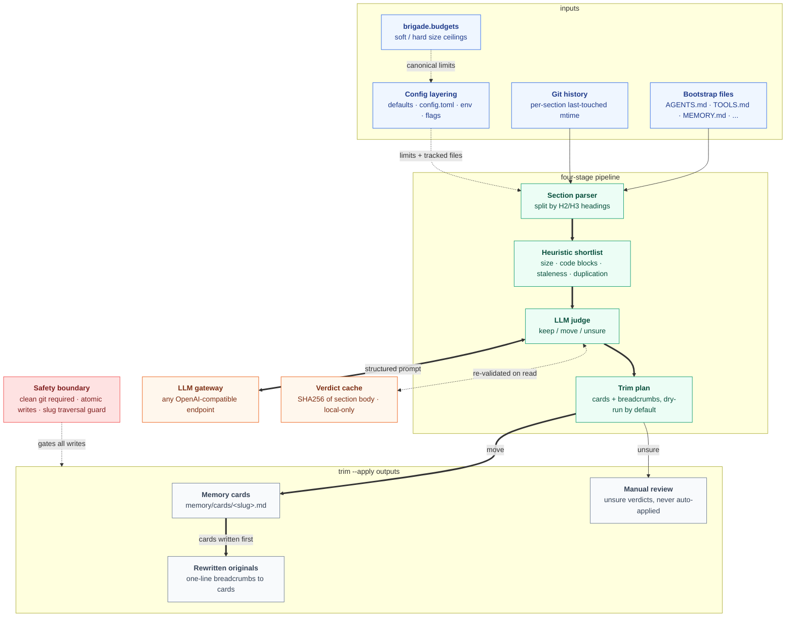

# bootstrap-doctor

bootstrap file doctor for OpenClaw. Audits the bootstrap markdown files that get loaded into every session prefix, flags sections that should move out, and rewrites the originals with one-line breadcrumbs to the relocated content.

## Why

OpenClaw bootstrap files (`AGENTS.md`, `TOOLS.md`, `SOUL.md`, `USER.md`, `SAFETY_RULES.md`, `IDENTITY.md`, `HEARTBEAT.md`, `MEMORY.md`) load into the session prefix on every turn. There is an empirical soft ceiling around 12,000 chars per file before content gets silently truncated mid-session, dropping bootstrap context with no error. Several files already brush that ceiling.

Triple that across `workspace-claude`, `workspace-main`, and `workspace-researcher` and the bloat surface multiplies. Today this is managed by hand: notice a file is too big, eyeball a section, copy it to `memory/cards/`, leave a breadcrumb. That gets skipped.

bootstrap-doctor automates the audit-and-relocate loop. Originals stay short, offloaded sections live in `memory/cards/`, breadcrumbs in the original point at the card.

## What it does

Three subcommands, dry-run by default:

```
bootstrap-doctor status              # read-only summary of every tracked file
bootstrap-doctor audit               # heuristic shortlist plus LLM verdicts (keep / move / unsure)
bootstrap-doctor trim [--apply]      # apply the audit plan: write cards, replace sections with breadcrumbs
```

`status` and `audit` are read-only. They can run even if `cards_dir` does not exist yet. `trim` defaults to dry-run; pass `--apply` to actually write.

## Install

From PyPI:

```bash
pipx install bootstrap-doctor
```

From a local clone:

```bash
git clone https://github.com/escoffier-labs/bootstrap-doctor
cd bootstrap-doctor
pipx install -e .
```

Requires Python 3.11+. Runtime dep: `requests` (used by the gateway client).

The bootstrap size limits (soft / hard / ceiling) are owned by [`brigade`](https://github.com/escoffier-labs/brigade) via `brigade.budgets`. bootstrap-doctor ships a mirrored fallback so it runs standalone without brigade installed. To source the limits from brigade directly and stay in lockstep with the rest of the tooling, install the optional extra:

```bash
pipx install "bootstrap-doctor[brigade]"
```

## Usage

### status

```
$ bootstrap-doctor status
workspace: /home/you/.openclaw/workspace
  AGENTS.md         11,805 chars   185 lines   OVER soft (10,000)
  TOOLS.md          11,589 chars   221 lines   OVER soft (10,000)
  SOUL.md            8,373 chars   124 lines   ok
  SAFETY_RULES.md    7,658 chars   118 lines   ok
  USER.md            7,229 chars    96 lines   ok
  IDENTITY.md        3,402 chars    52 lines   ok
  HEARTBEAT.md       2,109 chars    34 lines   ok
  MEMORY.md         15,720 chars   192 lines   OVER hard (11,500)
```

Use `--json` for machine-readable output with `soft_limit`, `hard_limit`, and one row per tracked file.

### audit

```
$ bootstrap-doctor audit
TOOLS.md
  ## Postiz API endpoints          [move]  -> postiz-api-endpoints.md
  ## Eero device culling            [keep]
  ## Jellyfin tool patterns         [move]  -> jellyfin-tool-patterns.md
AGENTS.md
  ## codex-builder agent gotchas    [unsure]
  ## ACPX-routed agent pinning      [move]  -> acpx-routed-agent-pinning.md
```

No writes. Verdicts cached by content hash so re-runs are cheap; pass `--no-cache` to force re-judgement.

### trim

```
$ bootstrap-doctor trim
DRY-RUN. Would write:
  memory/cards/postiz-api-endpoints.md       (+412 lines)
  memory/cards/jellyfin-tool-patterns.md     (+58 lines)
Would modify:
  TOOLS.md  -73 lines  (11,589 -> 8,402 chars)

Pass --apply to commit.
```

```
$ bootstrap-doctor trim --apply
```

`unsure` verdicts are never auto-applied. They show up in audit output for manual review.

## Config

`~/.config/bootstrap-doctor/config.toml`:

```toml
workspace_dir = "~/.openclaw/workspace"
cards_dir = "~/.openclaw/workspace/memory/cards"
gateway_url = "http://localhost:11434"
gateway_model = "deepseek-v4-pro:cloud"
soft_limit = 10000
hard_limit = 11500
tracked_files = [
  "AGENTS.md", "TOOLS.md", "SOUL.md", "USER.md",
  "SAFETY_RULES.md", "IDENTITY.md", "HEARTBEAT.md", "MEMORY.md",
]
named_workspaces = ["workspace-claude", "workspace-main", "workspace-researcher"]

[heuristics]
min_section_chars = 400
stale_days = 60
```

Layering: built-in defaults, then config file, then env vars, then CLI flags.

Path-like values must be non-empty strings without control characters or leading/trailing whitespace. `tracked_files` and `named_workspaces` must be local names, not paths.

## How it works



bootstrap-doctor runs a four-stage pipeline.

1. **Section parser.** Splits each tracked `.md` by H2/H3 headings into `(file, heading_path, body, char_count, last_touched_git_mtime)` tuples.
2. **Heuristic shortlist.** Flags sections that look offload-worthy: body > 400 chars, contains a code block > 10 lines, no git touch in 60+ days, or duplicated across multiple tracked files.
3. **LLM judge.** For each shortlisted section, POSTs to an OpenAI-compatible chat-completions endpoint (default `http://localhost:11434`, Ollama) with a structured prompt asking whether the section is *must-stay-loaded* (active rules, identity, currently-relevant state) or *reference-detail* (historical, exemplar, one-off setup). Verdict is one of `keep`, `move`, or `unsure`. Token budget capped per run; verdicts cached by SHA256 of section body in `~/.cache/bootstrap-doctor/verdicts.json`. Any OpenAI-compatible endpoint works (Ollama, OpenAI, vLLM, etc.); set `gateway_url` and `gateway_model` in config.
4. **Trim plan.** For each `move` verdict, writes a card to `memory/cards/<slug>.md` with the existing frontmatter convention, replaces the section in the original with a one-line breadcrumb pointing at the card. `keep` is a no-op. `unsure` is reported but never auto-applied.

## Safety

- Dry-run by default. `--apply` required for any write.
- Atomic writes: temp file plus rename, so a torn write cannot leave a half-rewritten bootstrap file.
- Path-traversal guard on card slugs (must resolve inside `cards_dir`).
- Refuses to run if `git status` in the workspace is dirty, so any change is revertable. If `cards_dir` lives in a separate git repo, that repo must be clean too. Override with `--force`.
- Verdict cache is local-only (`~/.cache/bootstrap-doctor/verdicts.json`). Clear with `--no-cache`.
- Card-write failures abort before bootstrap files are rewritten, so a failed run cannot leave breadcrumbs pointing at missing cards.

## Development

```bash
python3 -m pip install -e ".[dev]"
pytest -q
python3 -m ruff check .
python3 -m mypy src/bootstrap_doctor
python3 -m build
pip-audit . --skip-editable
```

## License

MIT
